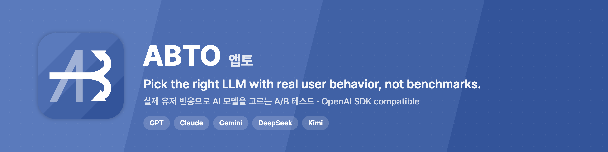

<p align="center">
  <a href="https://abto.app"></a>
</p>

<p align="center">
  <a href="https://abto.app"><b>Website</b></a> ·
  <a href="https://docs.abto.app"><b>Docs</b></a> ·
  <a href="https://github.com/greedy-co/abto-sdk"><b>SDK</b></a> ·
  <a href="https://blog.naver.com/abtoapp"><b>Blog</b></a> ·
  <a href="https://www.linkedin.com/company/abto-app/"><b>LinkedIn</b></a>
</p>

## 앱토(ABTO)는

**비싼 AI 모델이 우리 유저에게도 그만큼 좋을까요?** 벤치마크 점수로는 알 수 없습니다.

앱토는 같은 AI 기능을 쓰는 유저를 나눠 서로 다른 모델을 적용하고, 결제와 재방문 같은 **실제 행동을 AI 호출 비용과 함께** 비교합니다. 성과가 같으면 더 저렴한 모델로 옮겨 LLM 비용을 줄이고, 비싼 모델이 낫다면 그 차이가 비용을 유지할 근거가 됩니다.

| | |
|---|---|
| **기능 단위 A/B 테스트** | 기능마다 비교할 모델과 유저 비율을 정하고, 모델별 성과와 비용을 나란히 확인 |
| **안전한 교체** | 새 모델은 유저 10%에게만 먼저 적용하고, 문제가 있으면 바로 되돌리기 |
| **쉬운 연동** | OpenAI SDK는 그대로, base URL과 헤더만 변경 |
| **여러 모델을 한 방식으로** | GPT, Claude, Gemini, DeepSeek, Kimi |

### 베타 도입 결과

| 서비스 | 모델 비용 | 성과 |
|---|---|---|
| AI 오답노트 서비스 | **41% 절감** | 재방문율 18% 증가 |
| AI 이력서 서비스 | **28% 절감** | 유료 전환율 12% 증가 |

## 쓰던 코드는 그대로, 주소와 헤더만

```python
import os
from openai import OpenAI

client = OpenAI(
    base_url="https://gateway.abto.app/v1",  # 주소를 ABTO로
    api_key=os.environ["ABTO_API_KEY"],
)

client.chat.completions.create(
    model=model,
    messages=messages,
    extra_headers={
        "x-abto-key-openai": os.environ["OPENAI_API_KEY"],  # 쓰던 OpenAI 키 그대로
        "x-abto-device-id": device_id,
        "x-abto-feature-id": "checkout.suggest",
    },
)
```

Claude Code나 Codex를 쓴다면 [ABTO Skill](https://github.com/greedy-co/abto-sdk#가장-빠른-시작)을 설치하고 이렇게 요청하면 됩니다.

```text
이 프로젝트에 ABTO를 연동하고 실제 데이터 수신까지 검증해줘.
```

## SDK

모든 SDK는 [greedy-co/abto-sdk](https://github.com/greedy-co/abto-sdk) 한 저장소에서 제공합니다.

| 런타임 | 역할 | 설치 |
|---|---|---|
| Node.js | Gateway 호출 (Calling SDK) | `npm install @abto-app/calling openai` |
| Python | Gateway 호출 (Calling SDK) | `pip install "abto[openai]"` |
| Browser JavaScript | 이벤트 수집 (Event SDK) | `npm install @abto-app/event` |
| Flutter / Dart | 이벤트 수집 (Event SDK) | `dart pub add abto` |
| Android / Kotlin | 이벤트 수집 (Event SDK) | `implementation("app.abto:abto-app:1.1.0")` |
| iOS / macOS | 이벤트 수집 (Event SDK) | Swift Package Manager |

설치와 API 가이드: **[docs.abto.app](https://docs.abto.app)**

## 소식

2026년 9월 출시 소식이 [머니투데이](https://www.mt.co.kr/future/2026/09/23/2026092316470562301), [플래텀](https://platum.kr/archives/295148), [비석세스](https://besuccess.com/?p=186434), [데이터넷](https://www.datanet.co.kr/news/articleView.html?idxno=214704), [스타트업엔](https://www.startupn.kr/news/articleView.html?idxno=59991)에 소개되었습니다.

---

<details>
<summary><b>English</b></summary>

**ABTO** is an AI gateway and A/B testing service for LLM features. It splits real users of the same AI feature across different models, then compares real outcomes such as payments and retention against each model's call cost. When results are equal, move traffic to the cheaper model and cut LLM spend.

- OpenAI SDK compatible: change the base URL and a few headers
- GPT, Claude, Gemini, DeepSeek, Kimi through one interface
- Roll out a new model to 10% of users first, roll back in seconds
- SDKs for Node.js, Python, Browser JS, Flutter, Android, iOS: [greedy-co/abto-sdk](https://github.com/greedy-co/abto-sdk)

Start free at [abto.app](https://abto.app) · Docs at [docs.abto.app](https://docs.abto.app)

</details>

<p align="center"><sub>무료로 시작하기 → <a href="https://abto.app">abto.app</a> · 문의 <a href="mailto:contact@abto.app">contact@abto.app</a></sub></p>
